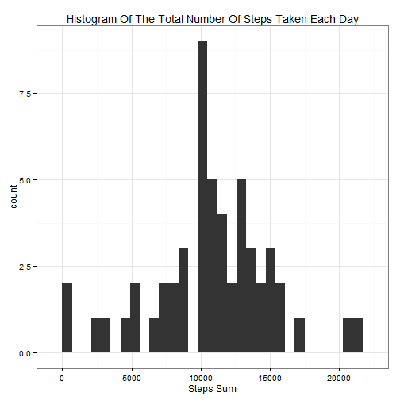
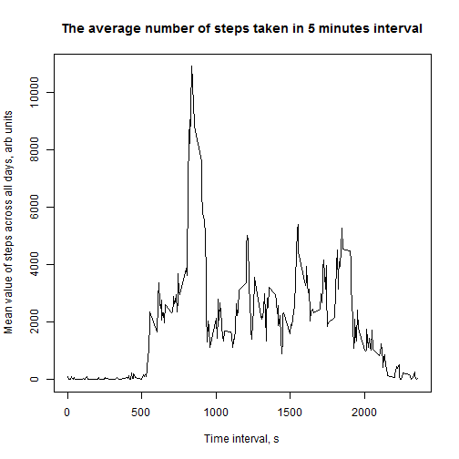
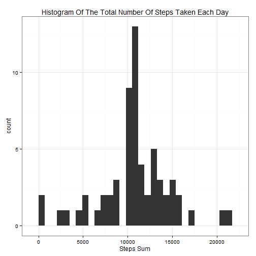
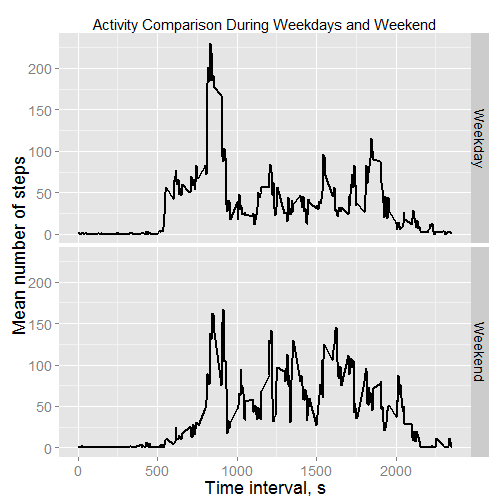

### Introduction

It is now possible to collect a large amount of data about personal movement using activity monitoring devices such as a Fitbit, Nike Fuelband, or Jawbone Up. These type of devices are part of the "quantified self" movement - a group of enthusiasts who take measurements about themselves regularly to improve their health, to find patterns in their behavior, or because they are tech geeks. But these data remain under-utilized both because the raw data are hard to obtain and there is a lack of statistical methods and software for processing and interpreting the data.

This assignment makes use of data from a personal activity monitoring device. This device collects data at 5 minute intervals through out the day. The data consists of two months of data from an anonymous individual collected during the months of October and November, 2012 and include the number of steps taken in 5 minute intervals each day.

### Data analysis

To start data analysis, all necessary libraries should be loaded.

```r
library(knitr)
library(plyr); library(dplyr)
library(ggplot2)
library(data.table)
```

Then data are downloaded and unzipped into working directory.


```r
setwd("C:\\Users\\Olga\\Documents\\Data_Science_class\\Reproducible_Research\\")
fileURL <- "https://d396qusza40orc.cloudfront.net/repdata%2Fdata%2Factivity.zip"
unzip("./activity.zip")
```

First, let us look at the total number of steps from the dataset where missing values are excluded. To do so, it is necessary to read in the dataset.


```r
activity <- read.csv("C:\\Users\\Olga\\Documents\\Data_Science_class\\Reproducible_Research\\activity.csv", header = TRUE, stringsAsFactors = FALSE)
without.NA <- activity[complete.cases(activity), ]
steps.by.day <- aggregate(without.NA$steps, by = list(without.NA$date), FUN  = sum)
```

It can be visualized through a histogram.


```r
ggplot(steps.by.day, aes(x)) + geom_histogram(position = "identity", binwidth = 700) + theme_bw() + ggtitle("Histogram Of The Total Number Of Steps Taken Each Day") + xlab("Steps Sum")
```

 

The mean and median total number of steps taken per day for the original dataset


```r
summarise(steps.by.day, mean = mean(x), median = median(x))
```

```
##       mean median
## 1 10766.19  10765
```

Now, let us look at the average number of steps over time dependance.

```r
average <- aggregate(without.NA$steps, by = list(without.NA$interval), FUN  = sum)
```


```r
plot(average$Group.1, average$x, type = "l", xlab = "Time interval, s", ylab = "Mean value of steps across all days, arb units", main = "The average number of steps taken in 5 minutes interval")
```

 

The 5-minute interval, on average across all the days in the dataset, contains the maximum number of steps

```r
average[which(average$mean == max(average$mean)), ]
```

```
## Warning in max(average$mean): no non-missing arguments to max; returning
## -Inf
```

```
## [1] Group.1 x      
## <0 rows> (or 0-length row.names)
```
The data from this study include a number of days/intervals where there are missing values (coded as NA). The presence of missing days may introduce bias into some calculations or summaries of the data. To exclude this bias, missing values will be replaced by the mean values of steps taken over all days for particular 5 minute interval.

```r
impute.mean <- function(x) replace(x, is.na(x), mean(x, na.rm = TRUE))
imputed.activity <- ddply(activity, ~ interval, transform, steps = impute.mean(steps))
steps.by.dayI <- aggregate(imputed.activity$steps, by = list(imputed.activity$date), FUN  = sum)
```


```r
ggplot(steps.by.dayI, aes(x)) + geom_histogram(position = "identity", binwidth = 700) + theme_bw() + ggtitle("Histogram Of The Total Number Of Steps Taken Each Day") + xlab("Steps Sum")
```

 

The mean total number of steps taken per day for the dataset with the filled-in missing values and that one for the dataset with omitted missing values match. But the median total number of steps taken per day for the dataset with the filled-in missing values slightly changes with comparison of the median number of steps for dataset with omitted missing values.


```r
summarise(steps.by.dayI, mean = mean(x), median = median(x))
```

```
##       mean   median
## 1 10766.19 10766.19
```
To compare activity during weekdays and weekend a new factor variable in the dataset with two levels - "weekday" and "weekend" is created to indicate whether a given date is a weekday or weekend day.

```r
new.activity <- imputed.activity
new.activity$date <- as.Date(new.activity$date)
new.activity$days <- as.character(weekdays(new.activity$date))
new.activity$days <- as.factor(ifelse(new.activity$days %in% c("Saturday","Sunday"), "Weekend", "Weekday"))
str(new.activity)
```

```
## 'data.frame':	17568 obs. of  4 variables:
##  $ steps   : num  1.72 0 0 47 0 ...
##  $ date    : Date, format: "2012-10-01" "2012-10-02" ...
##  $ interval: int  0 0 0 0 0 0 0 0 0 0 ...
##  $ days    : Factor w/ 2 levels "Weekday","Weekend": 1 1 1 1 1 2 2 1 1 1 ...
```
The dataset with the filled-in missing values has been averaged over steps across all weekday days or weekend days

```r
new.activity <- data.table(new.activity)
keycols <- c ("days", "interval")
setkeyv(new.activity, keycols)
mean.by.days <- new.activity[, lapply(.SD, mean), by = key(new.activity), .SDcols = "steps"]
```
Then a panel plot is built. It contains a time series plot (i.e. type = "l") of the 5-minute interval (x-axis) and the average number of steps taken, averaged across all weekday days or weekend days (y-axis).

```r
ggplot(mean.by.days, aes(x = interval, y = steps)) + facet_grid(days ~ .) +xlab("Time interval, s") + ylab("Mean number of steps") +geom_line(size = 1) + theme(text = element_text(size = 18), plot.title = element_text(size=15)) + ggtitle("Activity Comparison During Weekdays and Weekend")
```

 

Activity during weekdays has pronounced peak around interval 835 (presumably, in the morning) and then it decreases almost by 50%. Weekend activity is almost equally spread over the day.
